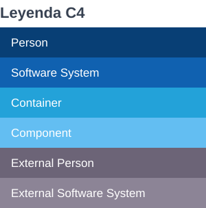

# 03 · Leyenda oficial C4

Todos los diagramas, imágenes y documentos PDF del repositorio usan **exclusivamente** esta leyenda.
Es la misma leyenda de la librería C4 que usa la Dirección de Arquitectura en Draw.io.



| Tipo C4 | Color de fondo | Borde | Texto | Tag Structurizr | Cuándo |
|---|---|---|---|---|---|
| **Person** | `#083F75` | `#052E57` | blanco | `Person` (automático) | Persona/rol de la organización |
| **Software System** | `#1061B0` | `#0B4884` | blanco | `Software System` (automático) | Sistema en el alcance del proyecto |
| **Container** | `#23A2D9` | `#0E7DAD` | blanco | `Container` (automático) | Aplicación, servicio, BD, cola, bucket |
| **Component** | `#63BEF2` | `#2E8BC9` | blanco | `Component` (automático) | Componente dentro de un contenedor |
| **External Person** | `#6C6477` | `#4D4756` | blanco | `External Person` | Persona fuera de la organización |
| **External Software System** | `#8C8496` | `#6B6474` | blanco | `External Software System` | Todo sistema fuera del alcance del proyecto |

## Personas: silueta de actor (obligatorio)

Toda persona (`Person` o `External Person`) se dibuja con **silueta de actor** (cabeza + cuerpo redondeado), igual que
`mxgraph.c4.person2` de la librería C4 de Draw.io. Nunca como caja o rectángulo.

- El estilo del tag `Person` usa `shape Person` (verificado por R7).
- Los motores de render del repositorio respetan la silueta: `render-c4.mjs` (notación Draw.io C4, por defecto en
  versiones nuevas). El render Mermaid de versiones antiguas (v1, v2 de Volarte) dibuja cajas y queda solo como evidencia.

## Réplicas de un Draw.io: color por página

Cuando una versión replica un Draw.io aprobado (`version.json` → `"render": "c4-drawio"`), el color de cada forma se toma
de la página del Draw.io (p. ej. un contenedor vecino en gris como `[Contenedor externo]` en un L3, o Entra ID azul en el
L1 y gris en el L2). Ese color se guarda en la **presentación de la vista** (`dsl/layout/<vista>.json`, campo `clase`) y
debe ser siempre uno de los seis colores de la leyenda; el informe de fidelidad (R9) verifica que coincide con la fuente.

## Fuente única

- Los estilos viven en [`estandares/c4/estilos-c4.dsl`](../../estandares/c4/estilos-c4.dsl). Cada versión de cada
  proyecto los incluye desde `dsl/views/styles.dsl`:

  ```
  !include ../../../../../estandares/c4/estilos-c4.dsl
  ```

- `estandares/c4/tema-c4-terpel.json` se **genera** desde ese archivo (`scripts/gen_theme.py`) para herramientas que
  consumen temas por URL (Structurizr Lite / on-premises). No se edita a mano.
- El renderizador (`scripts/render-diagrams.mjs`) lee los colores del mismo archivo y agrega la **leyenda al pie de
  cada SVG/PNG**; el PDF incluye una página de leyenda. Diagrama y leyenda nunca pueden diferir.

## Reglas (Agente Revisor · R7)

1. Los seis tags de la leyenda deben tener exactamente los colores de esta tabla.
2. **Solo** esos tags (más los neutros `Element`, `Deployment Node`, `Infrastructure Node`) pueden definir
   `background`, `color` o `stroke`. Cualquier otro tag que defina color es un **error**.
3. Los tags semánticos (`Database`, `Queue`, `BFF`, …) solo pueden definir `shape`, `border`, `strokeWidth`, `fontSize`.
4. `Pending` es la única excepción de borde: puede definir `stroke` (ámbar `#F59E0B`) para señalar decisiones abiertas.
5. Toda persona externa usa `External Person`; un sistema sin contenedores y sin `External Software System` genera
   advertencia (probablemente le falta el tag).

## Convenciones complementarias

| Elemento visual | Significado |
|---|---|
| Cilindro | Almacén de datos (base de datos, cache, bucket) |
| Borde ámbar | Decisión arquitectónica pendiente (tag `Pending`) |
| Flecha rotulada `propósito [tecnología]` | Dependencia / flujo; la tecnología declara protocolo y cifrado |
| Línea punteada gris | Relación lógica que atraviesa intermediarios (tag `Logical`) |
| Recuadro punteado | Agrupación lógica (`group`): dominio, capa, proyecto GCP |
| Nodo blanco con borde gris | Nodo de despliegue / infraestructura (vista de despliegue) |

## Cambiar la leyenda

La leyenda es un **estándar corporativo**: solo se modifica mediante PR aprobado por la Dirección de Arquitectura,
registrado en el [`CHANGELOG.md`](../../CHANGELOG.md) raíz, con ADR. Al cambiarla, las versiones congeladas **no** se
regeneran (conservan la notación con la que fueron aprobadas).
